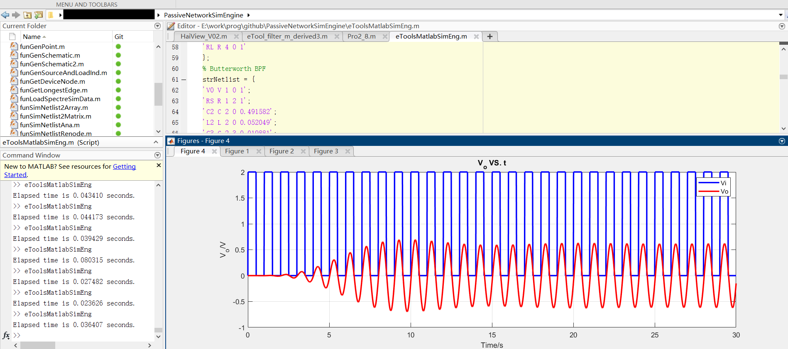

# Matlab无源网络仿真引擎(PassiveNetworkSimEngine)
> 这是一个Matlab版本的无源电路网络仿真引擎，目的是为了无源电路网络仿真验证，并且为以后无源电路网络优化打基础，更多可以关注微信公众号"[电路设计小工具](https://mp.weixin.qq.com/s/fxfEnir-hU0YvF9_CWyI6g)".

### 如何使用(how to use)
下载整个文件包： \
 \
顶层文件(Top file)： \
eToolsMatlabSimEng.m
#### 修改网表(modify the netlist)
 \
网表格式必须满足：
- 一个电压源或者一个电流源(如上图中得V0)
- 电阻负载，名称必须为RL，若关心电流则在网表中令RL得值为0即可

### 运行环境(Env)
win10, Matlab2021a
运行顶层文件后可将figure dock到Matlab集成环境中，会有更好的体验效果。
 \

### 程序结构
无源电路网络仿真引擎采用Matlab编程，主要分为3大模块：
- 原理图构建模块
- AC仿真模块
- 瞬态仿真模块

更多技术细节可以参考$^{[1][2][3]}$ \

### 运行效果(demo)

5阶椭圆低通滤波器仿真

5阶巴特沃斯带通滤波器仿真(瞬态仿真中步进需要取小些)

使用Spectre仿真器对上述带通滤波器进行仿真

仿真结果对比：

### 参考(ref)
[1] : [模拟无源滤波器设计（一）](https://mp.weixin.qq.com/s/wNRHyBHpimjU90bymHp7JA) \
[2] : [模拟无源滤波器设计（二）](https://mp.weixin.qq.com/s/3GMQs4WDm683tdAXqyoOgQ) \
[3] : [模拟无源滤波器设计（三）](https://mp.weixin.qq.com/s/nZFx7weLcO-WRKLbP0T4jQ) \
[4] : [欢迎关注电路设计小工具公众号](https://mp.weixin.qq.com/s/fxfEnir-hU0YvF9_CWyI6g) \
[5] : [Matlab源码地址](https://github.com/etools361/PassiveNetworkSimEngine)
